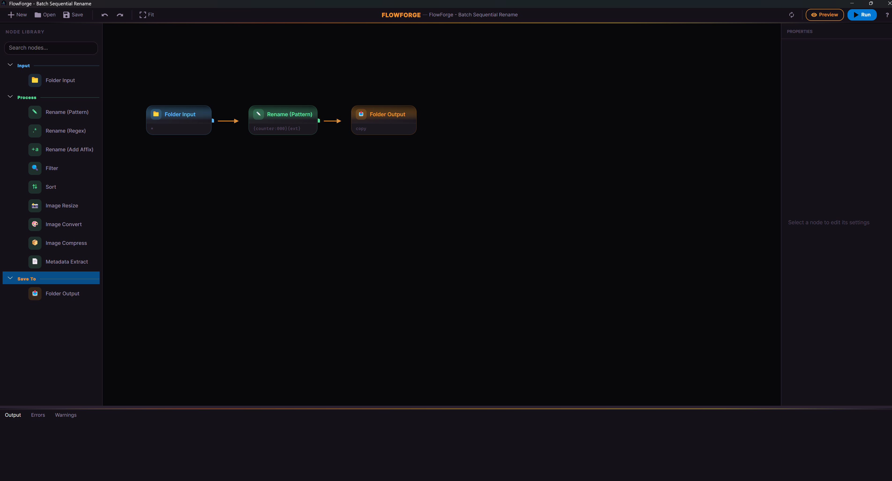
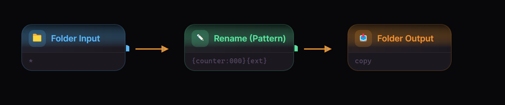
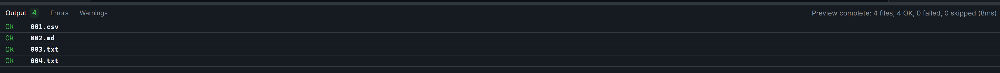

# FlowForge

A visual node-based file processing pipeline tool. Build reusable workflows for renaming, resizing, converting, and filtering files — no scripting required.


[](./LICENSE)

<p align="center">
  
</p>

## Overview

FlowForge lets you visually connect source, transform, and output nodes to build file processing pipelines:

- **Visual Node Editor** — Drag-and-drop canvas with pan, zoom, and wire connections
- **11 Built-in Nodes** — Sources, transforms, and outputs covering common file operations
- **Real-time Preview** — Simulate runs without touching any files
- **Pipeline Templates** — Pre-wired workflows for common tasks (photo import, batch rename, web export, compression)
- **CLI Runner** — Execute pipelines from the command line for automation and scripting
- **Cross-platform** — Runs on Windows, macOS, and Linux via Avalonia UI

## Features

### Node Types

| Category | Node | Description |
|----------|------|-------------|
| **Input** | Folder Input | Enumerate files from a directory with recursive and filter options |
| **Process** | Rename Pattern | Token-based renaming (`{name}`, `{date}`, `{counter}`, `{meta}`) |
| **Process** | Rename Regex | Regex find-and-replace with capture group support |
| **Process** | Rename Add Affix | Add prefix and/or suffix to filenames |
| **Process** | Filter | Conditional filtering by extension, size, date, or regex |
| **Process** | Sort | Reorder files by name, extension, or size |
| **Process** | Image Resize | Resize images with aspect ratio control |
| **Process** | Image Convert | Convert between JPEG, PNG, WebP, BMP, and TIFF |
| **Process** | Image Compress | Quality-based compression for JPEG, PNG, and WebP |
| **Process** | Metadata Extract | Read EXIF and file metadata into pipeline variables |
| **Save To** | Folder Output | Copy or move processed files to a destination directory |

### Pipeline Editor

- **Canvas** — Nodify-powered node graph with pan, zoom, drag, and rubber-band selection
- **Node Library** — Categorized sidebar with search and drag-to-canvas support
- **Properties Panel** — Auto-generated config forms from node schemas (text, number, boolean, file/folder picker, dropdown)
- **Execution Log** — Live progress with success/fail/skip counts and per-file details
- **Templates** — One-click pipeline starters: Photo Import, Batch Rename, Web Export, Compress
- **Midnight Theme** — Custom dark theme with GitHub Dark-inspired color palette

<p align="center">
  
</p>
<p align="center">
  
</p>

### CLI Runner

```bash
flowforge run pipeline.ffpipe [--input <dir>] [--output <dir>] [--dry-run] [--verbose]
```

- Override input/output directories per run
- Dry-run mode for safe previewing
- Structured logging with Serilog
- Exit codes: 0 (success), 1 (pipeline error), 2 (invalid arguments)

### Pipeline Format

Pipelines are saved as `.ffpipe` files (human-readable JSON, UTF-8):

```json
{
  "name": "Photo Import",
  "nodes": [
    { "id": "...", "typeKey": "FolderInput", "config": { "path": "/photos" } }
  ],
  "connections": [
    { "sourceId": "...", "targetId": "..." }
  ]
}
```

## Tech Stack

| Technology | Purpose |
|------------|---------|
| [.NET 10](https://dotnet.microsoft.com) | Runtime and build system |
| [Avalonia 11](https://avaloniaui.net) | Cross-platform desktop UI framework |
| [Nodify.Avalonia](https://github.com/miroiu/nodify) | Node graph editor control |
| [CommunityToolkit.Mvvm](https://learn.microsoft.com/dotnet/communitytoolkit/mvvm) | MVVM framework |
| [SixLabors.ImageSharp](https://sixlabors.com/products/imagesharp) | Image processing (resize, convert, compress) |
| [MetadataExtractor](https://github.com/drewnoakes/metadata-extractor-dotnet) | EXIF and file metadata reading |
| [Serilog](https://serilog.net) | Structured logging |
| [System.CommandLine](https://learn.microsoft.com/dotnet/standard/commandline) | CLI argument parsing |
| [xUnit](https://xunit.net) + [FluentAssertions](https://fluentassertions.com) | Testing framework |

## Project Structure

```
FlowForge/
├── FlowForge.sln
├── src/
│   ├── FlowForge.Core/           # Business logic (no UI references)
│   │   ├── Execution/            # PipelineRunner, NodeRegistry
│   │   ├── Models/               # FileJob, ExecutionResult
│   │   ├── Nodes/
│   │   │   ├── Base/             # Interfaces, ConfigField, exceptions
│   │   │   ├── Sources/          # FolderInputNode
│   │   │   ├── Transforms/       # 8 transform nodes
│   │   │   └── Outputs/          # FolderOutputNode
│   │   ├── Pipeline/             # PipelineGraph, Serializer, Templates
│   │   └── Settings/             # AppSettings, AppSettingsManager
│   ├── FlowForge.UI/             # Avalonia desktop app (MVVM)
│   │   ├── ViewModels/           # 14 view models
│   │   ├── Views/                # 5 view pairs + template selector
│   │   ├── Themes/               # MidnightTheme.axaml
│   │   └── Services/             # DialogService
│   └── FlowForge.CLI/            # CLI runner (System.CommandLine)
└── tests/
    └── FlowForge.Tests/          # 202 xUnit tests
        ├── Nodes/                # 11 node test files
        ├── Execution/            # Runner + registry tests
        ├── Pipeline/             # Serializer + template tests
        ├── Models/               # FileJob tests
        ├── Settings/             # AppSettings tests
        └── Helpers/              # TempDirectory, TestFileFactory, PipelineBuilder
```

## Getting Started

### Prerequisites

- [.NET 10 SDK](https://dotnet.microsoft.com/download) or later

### Build

```bash
# Clone the repository
git clone https://github.com/Wintersta7e/FlowForge.git
cd FlowForge

# Build all projects
dotnet build

# Run the desktop app
dotnet run --project src/FlowForge.UI

# Run the CLI
dotnet run --project src/FlowForge.CLI -- run pipeline.ffpipe --dry-run
```

### Run Tests

```bash
# Run all 202 tests
dotnet test --logger "console;verbosity=normal"

# Run specific test class
dotnet test --filter "FullyQualifiedName~RenamePatternNodeTests"
```

## Quick Start

1. **Launch the app** — `dotnet run --project src/FlowForge.UI`
2. **Use a template** — Click a template button on the empty canvas (Photo Import, Batch Rename, Web Export, or Compress)
3. **Or build from scratch** — Drag nodes from the sidebar onto the canvas
4. **Connect nodes** — Drag from an output pin to an input pin to create a wire
5. **Configure** — Select a node and edit its settings in the Properties panel
6. **Preview** — Click Preview to simulate the run without changing any files
7. **Run** — Click Run to execute the pipeline
8. **Save** — Save your pipeline as a `.ffpipe` file to reuse later

## Contributing

Contributions are welcome! Please:

1. Fork the repository
2. Create a feature branch
3. Make your changes
4. Ensure `dotnet build` passes with zero warnings
5. Ensure `dotnet test` passes
6. Submit a pull request

## License

MIT License — see [LICENSE](./LICENSE) for details.

## Support

- [Report issues](../../issues) or suggest features
- Star this repository if you find it useful
