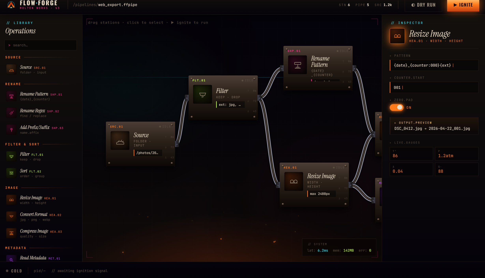

<div align="center">

# FlowForge

**A node-based file processing pipeline for everyday file chores.**

Wire source, transform, and output nodes into reusable workflows for renaming,
resizing, converting, and filtering files. Run from a desktop GUI or the command line.

[](https://dotnet.microsoft.com)
[](https://learn.microsoft.com/dotnet/csharp/)
[](https://avaloniaui.net)
[](LICENSE)
[](#status)
[](https://github.com/Wintersta7e/FlowForge/actions/workflows/ci.yml)

<br>



</div>

---

## Why

I built FlowForge for myself — a repeatable way to run the same boring file
chores (rename a folder of photos by date, resize a batch for the web, strip
metadata before sharing) without hand-writing a throwaway script every time.
It's **local-first**, **offline-capable**, and sends **no telemetry** — no
account, no network call, nothing leaves your machine.

It's a personal tool, not a product — but it's open source under MIT, and if it
looks useful to you, you're welcome to clone it and give it a try. There's no
adoption goal and no support guarantees, but issues and PRs are read.

The same pipelines run from a desktop GUI or the command line
(`flowforge run my-pipeline.ffpipe`) — two front-ends over one shared core engine.

## Status

Actively developed personal tool. The engine, node library, desktop UI, and CLI
are all implemented and covered by an extensive test suite (378 tests) under
strict analyzers (StyleCop + Meziantou, warnings-as-errors). The `.ffpipe`
format is stable across the 2.x line — treat it as a working tool you can build
and run, not a finished, packaged consumer app.

**Implemented:**
- Visual node editor — drag-and-drop canvas, pan/zoom, wiring, rubber-band
  selection, full undo/redo
- 11 built-in node types (see [Features](#features))
- `flowforge` CLI — `run` with per-run input/output overrides, dry-run,
  `--format json`, and a defined exit-code contract
- Pipeline templates — Photo Import, Batch Rename, Web Export, Compress
- Real-time progress — live scan count, per-file status, throughput reporting
- "Molten Works" dark theme — cast-iron stations, chrome pipes, mercury beads
  that flow along the pipes while a pipeline runs
- Cross-platform via Avalonia (Windows, macOS, Linux); self-contained Windows
  x64 build on the [Releases page](https://github.com/Wintersta7e/FlowForge/releases)

**Not done yet:** packaged / signed installers beyond the win-x64 release zip.

## Features

### Engine + CLI
- Pipeline runner with dry-run mode (**zero file I/O**), full `CancellationToken`
  support, and structured progress events
- **11 built-in node types:**
  - *sources & outputs:* `FolderInput`, `FolderOutput`
  - *rename:* `RenamePattern`, `RenameRegex`, `RenameAddAffix`
  - *organise:* `Filter`, `Sort`
  - *image:* `ImageResize`, `ImageConvert`, `ImageCompress`
  - *metadata:* `MetadataExtract`
- Token-based renaming (`{name}`, `{date}`, `{counter}`, `{meta}`), regex
  find/replace with capture groups, and EXIF / file-metadata reads
- Atomic `.ffpipe` writes (write-to-`.tmp`-then-rename); path guards keep every
  write inside its target directory
- Workflows are plain `.ffpipe` JSON — git-trackable, diffable, shareable
- `flowforge` CLI mirrors the GUI: per-run input/output overrides, dry-run,
  `--format json` for machine-readable output, exit codes (`0` success,
  `1` partial, `2` failure / bad args)

### Desktop editor
- Node-graph canvas (Nodify.Avalonia): pan, zoom, drag, rubber-band selection
- Categorised node library with search and drag-to-canvas
- Properties panel — config forms auto-generated from node schemas (text,
  number, boolean, file/folder picker, dropdown) with hover tooltips
- Undo/redo (Ctrl+Z / Ctrl+Y) for every editor action; config-field edits
  coalesce into single entries
- Live execution log with success / fail / skip counts and per-file detail
- Template starters, recent-pipelines menu, zoom-to-fit, keyboard-shortcut help dialog

### Explicitly declined (not on the roadmap)
- Media transcoding (FFmpeg) • PDF processing • Authentication or accounts • Telemetry or analytics • Network calls or cloud sync • Commercially licensed canvas libraries

## Stack

| Layer | Choice | Notes |
|---|---|---|
| Core | .NET 10, C# 14 | Pure logic, no UI references; strict analyzers from commit one |
| UI | Avalonia 11 (MVVM) | Cross-platform desktop; CommunityToolkit.Mvvm |
| Node graph | Nodify.Avalonia | Canvas, pan/zoom, typed-port wiring |
| Images | SixLabors.ImageSharp | Resize, convert, compress |
| Metadata | MetadataExtractor | EXIF / file-metadata reads |
| Logging | Microsoft.Extensions.Logging + Serilog | `ILogger<T>` everywhere; console + rolling file |
| DI | Microsoft.Extensions.DependencyInjection | `AddFlowForgeCore()` composition root |
| CLI | System.CommandLine | Subcommands + global flags |
| Tests | xUnit + FluentAssertions + Bogus | 378 tests |

## Quick Start

```bash
# Clone and build
git clone https://github.com/Wintersta7e/FlowForge.git && cd FlowForge
dotnet build

# Run the checks
dotnet test
dotnet format FlowForge.sln --verify-no-changes

# Desktop app
dotnet run --project src/FlowForge.UI

# CLI
dotnet run --project src/FlowForge.CLI -- --help
dotnet run --project src/FlowForge.CLI -- run pipeline.ffpipe --dry-run
```

.NET 10 SDK required to build from source. Prefer a binary? The self-contained
Windows x64 build is on the [Releases page](https://github.com/Wintersta7e/FlowForge/releases) — no SDK needed.

## Layout

```
FlowForge/
├── src/
│   ├── FlowForge.Core/    # engine, nodes, serializer, settings (no UI deps)
│   ├── FlowForge.UI/      # Avalonia desktop app (MVVM)
│   └── FlowForge.CLI/     # flowforge CLI (System.CommandLine)
├── tests/
│   └── FlowForge.Tests/   # xUnit + FluentAssertions + Bogus
├── samples/               # example .ffpipe pipelines
├── FlowForge.sln
├── Directory.Build.props  # .NET 10, analyzers, warnings-as-errors
└── .editorconfig          # code style + StyleCop / Meziantou rules
```

## Design Principles

1. **Local-first.** No network calls, no telemetry, no account — everything runs on your machine.
2. **Layered and testable.** `FlowForge.Core` is pure logic with no UI references; the UI and CLI are thin composition roots over the same engine.
3. **CLI is first-class.** Anything a pipeline does in the GUI runs headless from the CLI, with JSON output and a clear exit-code contract for scripting.
4. **Safe by default.** Dry-run does zero file I/O, path guards keep writes inside their target directory, and overwrite-with-backup is opt-in.
5. **Inspectable and reusable.** Pipelines are plain `.ffpipe` JSON — save them, diff them, re-run them.
6. **Strict from commit one.** TreatWarningsAsErrors, StyleCop + Meziantou analyzers, and a `dotnet format` gate enforced in CI.

## License

[MIT](LICENSE). The desktop app embeds three OFL-1.1 font families (Instrument Serif, Oswald, JetBrains Mono) — see [THIRD-PARTY-NOTICES.md](THIRD-PARTY-NOTICES.md).

---

FlowForge is a personal tool — built for everyday file chores, with no telemetry, analytics, or network calls.
